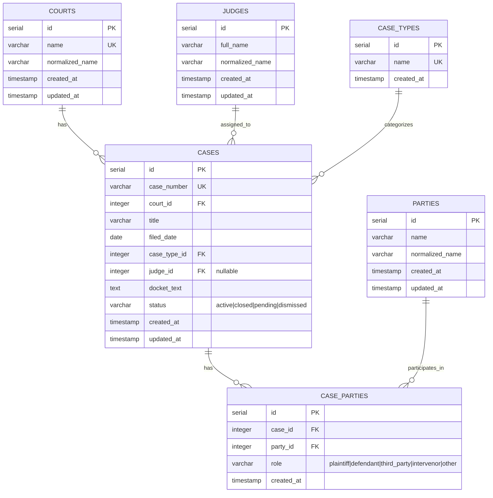

# Legal Docket Database Schema - Entity Relationship Diagram

## Mermaid ERD Diagram



## Text-Based ERD

```
┌─────────────────────────────────────────────────────────────────────────┐
│                           LEGAL DOCKET SCHEMA                           │
└─────────────────────────────────────────────────────────────────────────┘

┌──────────────┐
│   COURTS     │
├──────────────┤
│ id (PK)      │
│ name (UK)    │
│ normalized_ │
│   name       │
│ created_at   │
│ updated_at   │
└──────┬───────┘
       │
       │ 1:N
       │
       ▼
┌──────────────┐         ┌──────────────┐
│    CASES     │◄────────┤  JUDGES      │
├──────────────┤  N:1    ├──────────────┤
│ id (PK)      │         │ id (PK)      │
│ case_number  │         │ full_name    │
│   (UK)       │         │ normalized_  │
│ court_id (FK)│         │   name       │
│ title        │         │ created_at   │
│ filed_date   │         │ updated_at   │
│ case_type_id │         └──────────────┘
│   (FK)       │
│ judge_id (FK)│         ┌──────────────┐
│   (nullable) │◄────────┤ CASE_TYPES   │
│ docket_text  │  N:1    ├──────────────┤
│ status       │         │ id (PK)       │
│ created_at     │         │ name (UK)    │
│ updated_at   │         │ created_at   │
└──────┬───────┘         └──────────────┘
       │
       │ 1:N
       │
       ▼
┌──────────────┐         ┌──────────────┐
│ CASE_PARTIES │◄────────┤   PARTIES    │
├──────────────┤  N:1    ├──────────────┤
│ id (PK)      │         │ id (PK)      │
│ case_id (FK) │         │ name         │
│ party_id (FK)│         │ normalized_  │
│ role         │         │   name       │
│ created_at   │         │ created_at   │
└──────────────┘         │ updated_at   │
                         └──────────────┘

Legend:
PK = Primary Key
FK = Foreign Key
UK = Unique Key
N:1 = Many-to-One relationship
1:N = One-to-Many relationship
```

## Relationship Summary

### One-to-Many Relationships

1. **COURTS → CASES** (1:N)
   - One court can have many cases
   - Foreign Key: `cases.court_id` → `courts.id`
   - Constraint: `ON DELETE RESTRICT`

2. **JUDGES → CASES** (1:N, Optional)
   - One judge can be assigned to many cases
   - Foreign Key: `cases.judge_id` → `judges.id`
   - Constraint: `ON DELETE SET NULL` (nullable - some cases have no judge)

3. **CASE_TYPES → CASES** (1:N)
   - One case type can categorize many cases
   - Foreign Key: `cases.case_type_id` → `case_types.id`
   - Constraint: `ON DELETE RESTRICT`

### Many-to-Many Relationships

4. **CASES ↔ PARTIES** (N:M via CASE_PARTIES)
   - Many cases can have many parties
   - Junction table: `case_parties`
   - Includes role attribute (plaintiff, defendant, etc.)
   - Foreign Keys:
     - `case_parties.case_id` → `cases.id` (ON DELETE CASCADE)
     - `case_parties.party_id` → `parties.id` (ON DELETE CASCADE)
   - Unique constraint: `(case_id, party_id, role)` prevents duplicates

## Key Design Features

### Normalization
- **Courts**: Normalized to handle variations (e.g., "S.D.N.Y" vs "S.D.N.Y.")
- **Judges**: Normalized to handle title variations (e.g., "Hon. Maria" vs "Judge Maria")
- **Parties**: Normalized for matching variations (e.g., "Acme Corp" vs "Acme Corporation")

### Indexes
- Primary keys: All tables have indexed primary keys
- Foreign keys: All foreign key columns are indexed
- Composite indexes: 
  - `(judge_id, filed_date)` for judge + year queries
  - `(court_id, case_type_id)` for court + type queries
  - `(party_id, role)` for party role queries
- Full-text: GIN index on `docket_text` for text search

### Constraints
- **Unique**: `case_number`, court `name`, case type `name`
- **Check**: `status` enum, `role` enum
- **NOT NULL**: All required fields except `judge_id` (nullable)

### Triggers
- Auto-update `updated_at` timestamp on all tables with that field

